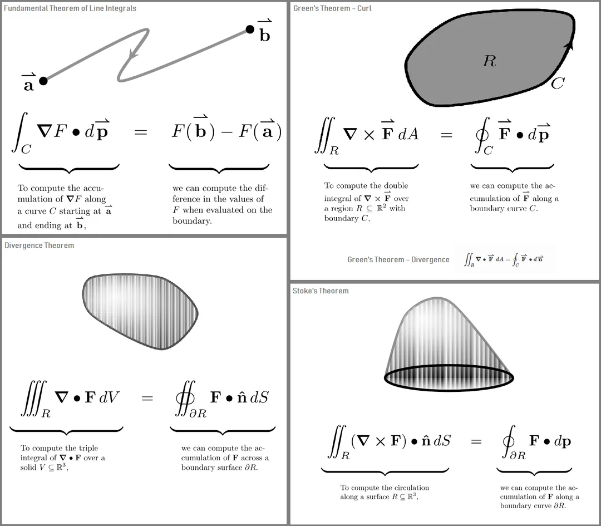

*Source: [Reddit - I made a little graphic for the Fundamental Theorems of Calc III](https://www.reddit.com/r/calculus/comments/a372hu/i_made_a_little_graphic_for_the_fundamental/)*

# 1. Unified Framework: Generalized Stokes' Theorem

All fundamental theorems of vector calculus are specific dimensional cases of the Generalized Stokes' Theorem:

$$\int_{\Omega} d\omega = \int_{\partial \Omega} \omega$$

Where $\Omega$ represents the interior region, $\partial \Omega$ denotes its boundary, and $d\omega$ represents the exterior derivative. The core principle is that the integration of a derivative over a domain equals the integration of the original form over its boundary.

## 1D: Fundamental Theorem of Calculus
* **Formula:** $\int_a^b f'(x) \, dx = f(b) - f(a)$
* **Domain:** 1D interval $[a, b]$ with 0D boundary endpoints $a$ and $b$.

## 2D: Green's Theorem
* **Formula:** $\iint_D \left( \frac{\partial Q}{\partial x} - \frac{\partial P}{\partial y} \right) \, dxdy = \oint_C (P\,dx + Q\,dy)$
* **Domain:** 2D planar region $D$ bounded by a 1D closed curve $C$.

## 3D Surfaces: Stokes' Theorem (Curl Theorem)
* **Formula:** $$\iint_S (\nabla \times \mathbf{F}) \cdot d\mathbf{S} = \oint_{\partial S} \mathbf{F} \cdot d\mathbf{r}$$
* **Interpretation:** The surface integral of the curl of a vector field $\mathbf{F}$ over an open surface $S$ equals the line integral of $\mathbf{F}$ along the boundary curve $\partial S$.

## 3D Volumes: Gauss's Theorem (Divergence Theorem)
* **Formula:** $$\iiint_V (\nabla \cdot \mathbf{F}) \, dV = \oiint_{\partial V} \mathbf{F} \cdot d\mathbf{S}$$
* **Interpretation:** The volume integral of the divergence of a vector field $\mathbf{F}$ over a solid $V$ equals the net flux of $\mathbf{F}$ passing through the closed bounding surface $\partial V$.

---

# 2. Operational Rules of the Del ($\nabla$) Operator

The del operator $\nabla$ functions simultaneously as a vector and a differential operator. When applied to products, it follows the product rule (Leibniz rule) rather than the chain rule.

## Vector Identity: $\nabla \times (\varphi \mathbf{A})$
$$\nabla \times (\varphi \mathbf{A}) = \varphi (\nabla \times \mathbf{A}) + (\nabla \varphi) \times \mathbf{A}$$

**Derivation and Structural Mechanics:**
By applying the product rule, $\nabla$ differentiates $\varphi$ and $\mathbf{A}$ sequentially:
1. When differentiating $\mathbf{A}$, the scalar field $\varphi$ acts as a constant coefficient and is factored out, yielding $\varphi (\nabla \times \mathbf{A})$.
2. When differentiating $\varphi$, $\nabla$ operates directly on the scalar to produce the gradient vector $\nabla \varphi$. The underlying cross product structure ($\times$) with the remaining vector field $\mathbf{A}$ must be preserved, yielding $(\nabla \varphi) \times \mathbf{A}$.

This can be verified by expanding the $x$-component using partial derivatives:
$$\left[\nabla \times (\varphi \mathbf{A})\right]_x = \frac{\partial}{\partial y}(\varphi A_z) - \frac{\partial}{\partial z}(\varphi A_y)$$
Applying the standard product rule:
$$= \left( \varphi \frac{\partial A_z}{\partial y} + A_z \frac{\partial \varphi}{\partial y} \right) - \left( \varphi \frac{\partial A_y}{\partial z} + A_y \frac{\partial \varphi}{\partial z} \right)$$
Rearranging the terms:
$$= \varphi \left( \frac{\partial A_z}{\partial y} - \frac{\partial A_y}{\partial z} \right) + \left( \frac{\partial \varphi}{\partial y}A_z - \frac{\partial \varphi}{\partial z}A_y \right) = \left[ \varphi (\nabla \times \mathbf{A}) + (\nabla \varphi) \times \mathbf{A} \right]_x$$

---

# 3. Summary

| Theorem | Interior ($\Omega$) | Boundary ($\partial \Omega$) | Operator |
| :--- | :--- | :--- | :--- |
| **Fundamental Theorem** | 1D Segment | 0D Endpoints | $d/dx$ |
| **Stokes' Theorem** | 2D Surface | 1D Curve | Curl ($\nabla \times$) |
| **Divergence Theorem** | 3D Volume | 2D Closed Surface | Divergence ($\nabla \cdot$) |